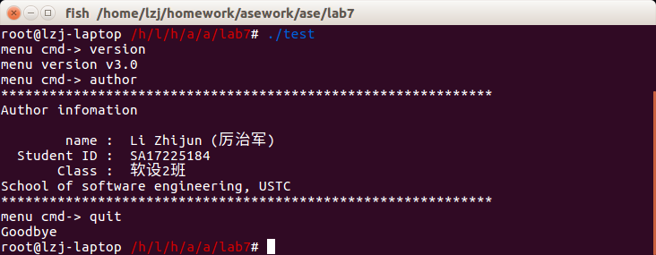
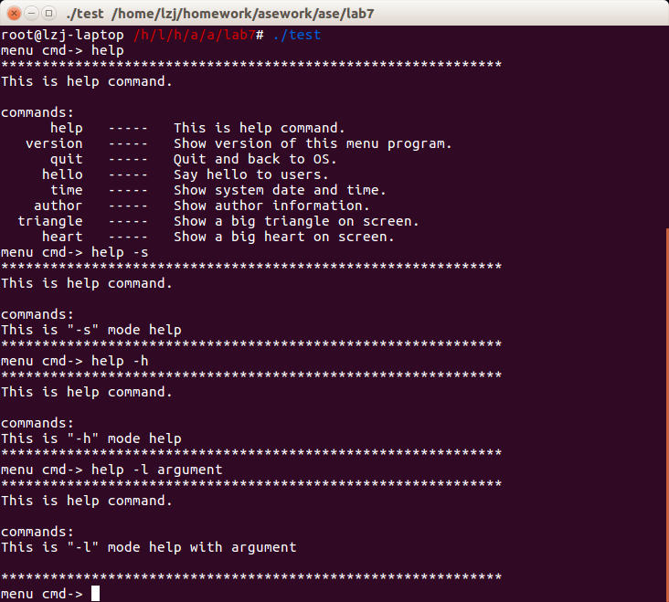

# 实验七：将menu设计为可重用的子系统
#### SA17225184 厉治军
## 目录
1. 实验要求
1. 实验过程和实验结果
1. 实验心得  
## 1. 实验要求
新创建一个目录lab7完成实验。
- 为menu子系统设计接口，并写用户范例代码来实现原来的功能；
- 使用make和make clean来编译程序和清理自动生成的文件；
- 使menu子系统支持带参数的复杂命令，并在用户范例代码中自定义一个带参数的复杂命令；
- 可以使用getopt函数获取命令行参数。
## 2. 实验过程和实验结果
### 2.0 拉代码并创建实验文件夹
``` shell
cd /home/lzj/homework/asework
git clone git@github.com:lzjustc/ase.git
cd ase
mkdir lab7
```
### 2.1 为menu子系统设计接口
- 在menu.c中去掉main函数并增加函数MenuConfig和ExecuteMenu，作为接口使用以增加通用性。

``` c++
int MenuConfig(char* cmd, char* desc, int(*handler)(int argc, char* argv[]))
{
    tDataNode* pNode = NULL;
    if(head == NULL)
    {
        head = CreateLinkTable();
        pNode = (tDataNode*)malloc(sizeof(tDataNode));
        pNode->cmd = "help";
        pNode->desc = "This is help command.";
        pNode->handler = Help;
        AddLinkTableNode(head,(tLinkTableNode*)pNode);
    }
    pNode = (tDataNode*)malloc(sizeof(tDataNode));
    pNode->cmd = cmd;
    pNode->desc = desc;
    pNode->handler = handler;
    AddLinkTableNode(head,(tLinkTableNode*)pNode);
    return 0; 
}
```
``` c++
int ExecuteMenu()
{
    while(1)
    {
        int argc = 0;
        char *argv[CMD_MAX_ARGV_LEN];
        char cmd[CMD_MAX_LEN];
        char *pcmd = NULL;
        printf("menu cmd-> ");
        //scanf("%s", cmd);
        pcmd = fgets(cmd, CMD_MAX_LEN, stdin);
        if(pcmd == NULL)
        {
            continue;
        }
        pcmd = strtok(pcmd, " ");
        while(pcmd != NULL && argc < CMD_MAX_ARGV_LEN)
        {
            argv[argc] = pcmd;
            argc++;
            pcmd = strtok(NULL, " ");
        }
        if(argc == 1)
        {
            int len = strlen(argv[0]);
            *(argv[0] + len - 1) = '\0';
        }          
        tDataNode* p = FindCmd(head, cmd);      
        if(p == NULL)
        {
            printf("error: Wrong command!\n");
        }
        else
        {
            p->handler(argc, argv);
        }
    }
    return 0;
}
```
### 2.2 写用户范例代码来实现原来的功能
将原`menu.c`中的功能性代码搬入新的`test.c`中，为了代码的使用简洁，采用了最初加入各个命令的形式，首先写入数据结构：
``` c++
typedef struct CMDNode
{
	char* cmd;
	char* desc;
	int(*handler)(int argc, char* argv[]);
}tCMDNode;
```
定义全局变量
``` c++
tCMDNode dHead[] =
{
	{ "version","Show version of this menu program.", Version },
	{ "quit", "Quit and back to OS.", Quit },
	{ "hello", "Say hello to users.", Hello },
	{ "time", "Show system date and time.", Time },
	{ "author", "Show author information.", Author },
	{ "triangle", "Show a big triangle on screen.", Triangle },
	{ "heart", "Show a big heart on screen.", Heart },
};
```
使用`InitMenuData`来初始化数据链表
``` c++
int InitMenuData(tCMDNode* dHead, int length)
{
	int i;
	for (i = 0; i < length; i++)
	{
		tCMDNode* pCMDNode = &dHead[i];
		MenuConfig(pCMDNode->cmd, pCMDNode->desc, pCMDNode->handler);
	}
	return 0;
}
```
这样使得主程序非常简洁明了
``` c++
int main(int argc, char* argv[])
{
	InitMenuData(dHead, numOfCmdExHelp);
	ExecuteMenu();
	return 0;
}
```
### 2.3 使用make和make clean来编译程序和清理自动生成的文件
创建文件`Makefile`，内容如下：
```
CC_PTHREAD_FLAGS	= -lpthread
CC_FLAGS		= -c
CC_OUTPUT_FLAGS		= -o
CC			= gcc
RM			= rm
RM_FLAGS		= -f

TARGET			= test
OBJS			= linktable.o menu.o test.o

all:	$(OBJS)
	$(CC) $(CC_OUTPUT_FLAGS) $(TARGET) $(OBJS)

.c.o:
	$(CC) $(CC_FLAGS) $<

clean:
	$(RM) $(RM_FLAGS) $(OBJS) $(TARGET) *.bak

```
使用make命令完成编译：  
  
编译并运行结果如图  

### 2.4 使menu子系统支持带参数的复杂命令，并在用户范例代码中自定义一个带参数的复杂命令；可以使用getopt函数获取命令行参数。
在Help函数中增加了一段自定义参数的命令，使用了`getopt`函数来获取命令行参数
``` c++
int Help(int argc, char* argv[])
{
    int ch;
    char* ch_prom;
	printf("*************************************************************\n");
	printf("This is help command.\n\n");
	printf("commands:\n");
    if(argc ==1)
    {
        ShowAllCmd(head);
        return 0;
    }
    while((ch = getopt(argc, argv, "shl:")) != -1)
    {
        switch(ch)
        {
            case 's':
                printf("This is \"-s\" mode help\n");
                break;
            case 'h':
                printf("This is \"-h\" mode help\n");
                break;
            case 'l':
                ch_prom = optarg;
                printf("This is \"-l\" mode help with %s\n", ch_prom);
                break;
            case '?':
                printf("Wrong argument!\n");
        }
    }
    optind = 1;
	printf("*************************************************************\n");
    return 0;
}
```
结果如下图  
  

## 3 实验心得
- 一个工程中的源文件不计其数，其按类型、功能、模块分别放在若干个目录中，makefile定义了一系列的规则来指定，哪些文件需要先编译，哪些文件需要后编译，哪些文件需要重新编译，甚至于进行更复杂的功能操作，因为Makefile就像一个shell脚本一样，其中也可以执行操作系统的命令。  
   
- `getopt()`用来分析命令行参数。参数`argc`和`argv`分别代表参数个数和内容，跟`main()`函数的命令行参数是一样的。参数`optstring`为选项字符串， 告知 `getopt()`可以处理哪个选项以及哪个选项需要参数，如果选项字符串里的字母后接着冒号`:`，则表示还有相关的参数，全域变量`optarg` 即会指向此额外参数。如果在处理期间遇到了不符合`optstring`指定的其他选项`getopt()`将显示一个错误消息，并将全域变量`optopt`设为`?`字符，如果不希望`getopt()`打印出错信息，则只要将全域变量`opterr`设为0即可。
## github代码仓库地址
完整代码见
[代码仓库：https://github.com/lzjustc/ase/tree/master/lab7](https://github.com/lzjustc/ase/tree/master/lab7/)


